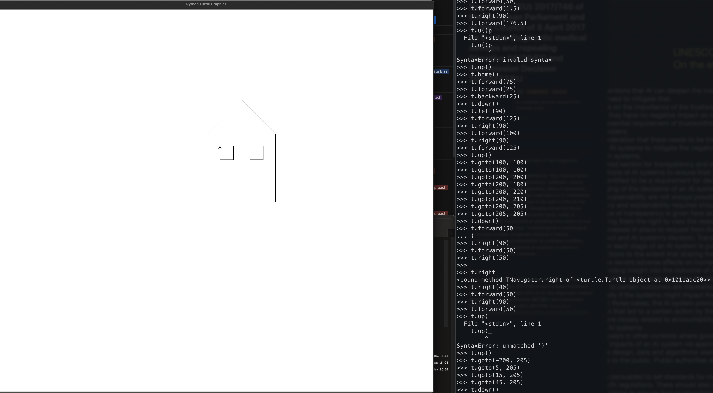

I like coding, I sometimes code in the weekends and on holidays. I like coding because it teaches me how computers work and how developers make websites. It also teaches me problem solving.

I started learning Python last year. I like Python because it is an easy language to understand and learn about programming. It also is widely used in machine learning and AI software.

Here is a piece of code I've written in Python that shows how many Ninjas I can fight 😄 (using conditions):

```
ninjas = 5
if ninjas < 10:
    print("i can fight those ninjas")
elif ninjas < 30:
    print("that will be a stuggle but i can take them")
elif ninjas < 50:
    print("thats too many")
```

And here's code for how long I can walk based on the weather 🌧️ (using loops and conditions):

```
step = 0
badweather = False
tired = False

while step < 10000:
    print(step)
    if step >= 5000:
        tired = True

    if tired == True or badweather == True:
        break
    else:
        step = step + 1
```

Here's a drawing on the screen that I created using [Python Turtle Graphics package](https://docs.python.org/3/library/turtle.html) (zoom in or open image a new tab to display in better resolution and detail):



Lately, I have been working on an autonomous car with my mum. The car shall self-drive and shall be able to interact with the user. Currently, we have connected a Raspberry Pi to an Arduino Uno that controls the motors on the wheels of the car. The Pi recieves directions signals from an iOS app that we developed, and sends that to the Arduino board to control the car. The car has an ultrasound sensor which we programmed to stop when nearing an obstacle. In the next stage, we will connect a camera to the car and write the python code needed for facial recognition as well as detecting obstacles (and taking action based on that). You can find the code of this project in [this repository](https://github.com/HebaNAS/Yezoo). I'm planning to write a series of blogs to document the work on the autonomous car and to sharing my learnings, mistakes and achievements. I will work on this during school breaks.


I'm enjoying my journey learning about programming and hope to continue developing my skills and sharing my enthusiam with others.

